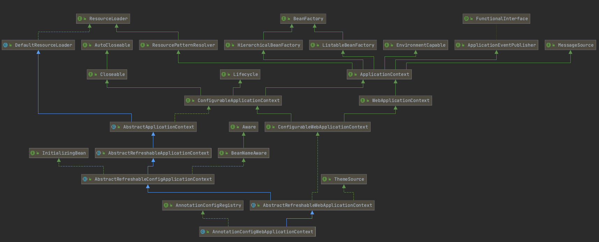
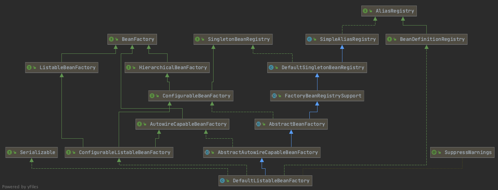

# Spring

https://docs.spring.io/spring-framework/docs/current/reference/html/index.html

[SPRING源码教程_图灵周瑜](https://www.bilibili.com/video/BV1dK4y127mH?p=38)

# 概念

## 什么是BeanDefinition?

1. beanClass
2. scope
3. isLazy
4. dependsOn
5. primary
6. initMethodName

## 什么是BeanFactory？

DefaultListableBeanFactory的功能

单例Bean、Bean别名、父子BeanFactory、Bean类型转化、Bean后置处理、FactoryBean、自动装配

## 什么是Bean生命周期？

1. BeanDefinition，Bean定义

2. 构造方法推断，选出一个构造方法

3. 实例化，构造方法反射得到对象，可以通过BeanPostProcessor机制对实例化进行干预

   - 实例化前
   - 实例化后

4. 属性填充，给属性进行自动填充，就是自动注入、依赖注入

5. 初始化，对其他属性赋值、校验

   - @Override postProcessBeforeInitialization

   - @PostConstruct

   - afterPropertiesSet

6. 初始化后，AOP通过BeanPostProcessor机制实现、生成代理对象

## @Autowire是如何工作的？

1. @Autowired加载某个属性上

   在属性填充这一步，基于实例化出来的对象，对该对象中加注解的属性自动给属性赋值

2. @Autowired加载某个方法上

   在属性填充这一步，根据方法的参数类型、参数名称从Spring容器中找到对象当做方法入参，自动反射调用该方法

3. @AutoWired加在构造方法上

## @Resource

1. 先判断该属性名字在Spring容器中是否存在Bean对象
2. 如果不存在，根据属性类型找

## @Value是如何工作的？

~~~java
// 配置文件找，找不到注入abc字符串
@Value("${abc}")
// 容器找bean，找不到报错
@Value("#{abc}")
~~~

## 什么是FactoryBean？

小工厂

## 什么是ApplicationContext？

比BeanFactory更加强大的Spring容器

- EnvironmentCapable
  获取操作系统环境变量JVM环境变量
  
- ListableBeanFactory
  获取所有beanNames、判断某个beanName是否存在beanDefinition对象、统计BeanDefinition个数、获取某个类型对应的所有beanNames等功能
  
- HierarchicalBeanFactory

  获取父BeanFactory、判断某个name是否存在bean对象

- MessageSource

  国际化功能

- ApplicationEventPublisher

  事件发布

- ResourcePatternResolver

  加载文件图片等资源

## BeanPostProcessor是什么？

后置处理器

## AOP是如何工作的？

- Advice

  通知建议，代理逻辑

- Pointcut

  切入点，类、方法

- Advisor

  Advice+Pointcut，代理逻辑和切入点的一个整体

- Weaving

  织入

- Target

  目标对象

- Join Point

  方法的执行点

## AOP工作原理

1. 先实例化一个对象，也就是target对象
2. 对target进行属性填充
3. 判断target对象有没有对应的切面
4. 通过Cglib或JDK动态代理机制生成一个代理对象，作为最终的bean对象

# Core

## 1.The IoC Container

### 1.6 Customizing the Nature of a Bean

#### 1.6.1 lifecycleCallbacks

##### Initialization Callbacks

~~~java
org.springframework.beans.factory.InitializingBean
~~~

### 1.8 Container Extension Points

#### 1.8.3 Customizing Instantiation Logic with a FactoryBean

- 应用

  - spring框架整合mybatis框架

    ```java
    MybatisAutoConfiguration
    MapperFactoryBean
    AutoConfiguredMapperScannerRegistrar
    ```

### 1.9 Annotation-based Container Configuration

#### 1.9.2 Using @Autowired

- 优先byType，后byName

- 推断构造方法
  - @Autowired(required = false)
    - 优先选择参数，多的
    - 优先选择参数，都可以被注入的

#### 1.9.9 Using @PostConstruct and @PreDestroy

### 1.12 Java-based Container Configuration

#### 1.12.2 Instantiationg the Spring Container by Using AnnotationConfigApplicationContext

~~~java
AnnotationConfigApplicationContext
~~~


~~~java
AnnotationConfigWebApplicationContext
~~~



#### 1.12.5 Composing Java-based Configurations

##### Using the @Import Annotation

- @Import注解中使用ImportBeanDefinitionRegistrar向容器中注册bean

### 1.16 The BeanFactory

~~~java
DefaultListableBeanFactory
~~~



### 1.18 Container Extension Points

#### 1.18.1 Customizing Beans by Using a BeanPostProcessor

```java
InstantiationAwareBeanPostProcessor
```

## 4.Spring Expression Language(SpEL)

[SpEL语法扫盲与查询手册](https://spring.hhui.top/spring-blog/2020/05/18/200518-SpringBoot%E7%B3%BB%E5%88%97%E4%B9%8BSpEL%E8%AF%AD%E6%B3%95%E6%89%AB%E7%9B%B2%E4%B8%8E%E6%9F%A5%E8%AF%A2%E6%89%8B%E5%86%8C/)

