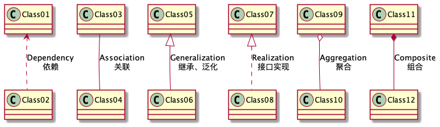
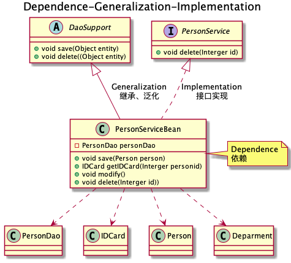
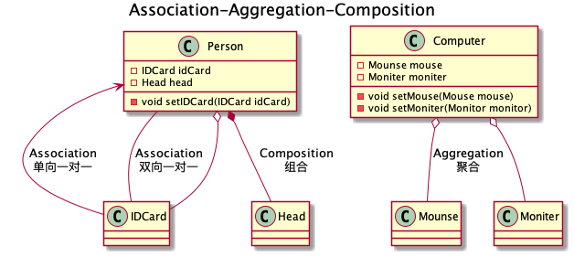

# Java设计模式

## 1 介绍

> https://www.bilibili.com/video/BV1G4411c7N4?p=3

## 2 设计模式的七大原则

### 2.0 设计模式的目的

- 代码重用性
- 可读性
- 可扩展性
- 可靠性（增加新功能，对原来的功能没有影响）
- 高内聚、低耦合

### 2.1 单一职责

1. 一个类只负责一项职责
2. 提高类的可读性，可维护性
3. 降低变更引起的风险
4. 通常应当遵守单一职责原则，只有逻辑足够简单，才可以在代码级违反单一职责原则；只有类中方法数量足够少，才可以在方法级别保持单一职责原则

### 2.2 接口隔离

> Interface Segregation Principle

1. 一个类对另一个类的依赖应该建立在最小的接口上
2. 所谓接口隔离，将功能接口拆分为独立的几个接口，类分别继承接口并重写，被别的类依赖

### 2.3 依赖倒转

> Dependence Inversion Principle

1. 高层模块不应该依赖底层模块，二者都应该依赖其抽象

2. **抽象不应该依赖细节，细节应该依赖抽象**

3. 依赖倒转的核心思想是面向接口编程

4. 依赖倒转原则的设计理念：相对于细节的多变性，抽象的东西要稳定的多。已抽象为基础搭建的架构比以细节为基础的架构要稳定的多。在java中，抽象指的是接口或抽象类，细节就是具体的实现类。

5. 使用接口或抽象类的目的是制定好规范，而不设计任何具体的操作，把展现细节的任务交给他们的实现类去完成

6. 依赖关系传递的三种方式

   1. 接口传递

      ~~~java
      static class OpenAndClose implements IOpenAndClose {
        @Override
        public void open(ITV tv) {
          tv.play();
        }
      }
      interface IOpenAndClose {
        void open(ITV tv);
      }
      ~~~

   2. 构造器传递

      ~~~java
      static class OpenAndClose implements IOpenAndClose {
        public ITV itv;
      
        public OpenAndClose(ITV itv) {
          this.itv = itv;
        }
      
        @Override
        public void open() {
          itv.play();
        }
      }
      interface IOpenAndClose {
        void open();
      }
      ~~~

   3. setter方式传递

      ~~~java
      static class OpenAndClose implements IOpenAndClose {
        public ITV itv;
        @Override
        public void open() {
          itv.play();
        }
      
        @Override
        public void setTv(ITV itv) {
          this.itv = itv;
        }
      }
      interface IOpenAndClose {
        void open();
        void setTv(ITV itv);
      }
      ~~~

7. 注意事项和细节

   1. 底层模块尽量都要有抽象类或接口，或者两者都有，程序稳定性更好
   2. 变量的声明雷翔尽量是抽象类或接口，这样我们的变量应用和实际对象之间，就存在一个缓存层，利于程序扩展和优化
   3. 集成式遵循里式替换原则

### 2.4 里式替换

> Liskov Substitution Principle

1. MIT 1988 姓李女士
2. 所有引用基类的地方必须能透明地使用其子类的对象
3. 使用继承是，尽量不要重写父类的方法
4. 用聚合，组合，依赖，来替换原来的继承
   - 聚合，组合，指原理的父类，通过new父类为，子类的一个属性，来使用原来的父类方法

### 2.5 开闭

> Open Closed Principle

1. （提供方）扩展开放，（使用方）修改关闭。用抽象构建框架，用实现扩展细节
2. 软件变化，通过扩展软件实体的香味来实现变化，而不是通过修改已有的代码来实现变化

### 2.6 迪米特

> Demeter Principle

1. 最少知道原则，对于被依赖的类，不管多复杂，尽量将逻辑封装在类的内部，对外只有public方法
2. 只与直接的朋友通信
3. 概念
   - 朋友关系：即耦合关系，依赖，关联，组合，聚合等
   - 直接的朋友：成员变量，方法参数，方法返回值中的类
   - 非直接朋友：即默认的类，局部变量中的类，最好不要出现

### 2.7 合成复用

> Composite Reuse Principle

1. 尽量使用合成、聚合的方式，而不是使用继承
2. 概念
   1. 聚合 Aggregation setA(A a)
   2. 组合 Composite private A a = new A();

### 2.8 设计原则核心思想

1. 找出应用中可能需要变化之处，把他们独立出来，不要和那些不需要变化的代码混在一起
2. 针对接口编程，而不是针对现实编程
3. 为了交互对象之间的松耦合设计而努力

## 3 UML类图

### 3.1 UML基本介绍

- 软件PlantUML
  - 代码开发画各种图
  - https://plantuml.com/zh/

- UML Unified modeling language 统一建模语言，用户软件系统分析和设计的语言工具，帮助软件开发人员进行思考和记录思路的结果
- UML本身是一套符号的规定

### 3.2 UML图

- 用例图
- 静态结构图：**类图**、对象图、包图、组件图、部署图
- 动态行为图：交互图（时序与协作图）、状态图、活动图
- 说明
  - 类图是描述类与类之间的关系的，是UML图中最核心的

### 3.3 UML类图

- 用户描述系统中的类本身的组成和类之间的各种静态关系

- 类之间的关系：依赖、继承（泛化）、实现、关联、聚合、组合

  

### 3.4 依赖关系 Dependence

- 只要在类中用到对方，那么就存在依赖关系

- 类中用到对方、类的成员属性、方法的返回类型、接收的参数类型、方法中使用到

### 3.5 泛化、继承关系 Generalization

- 依赖关系的特例

### 3.6 实现关系 Implementation

- 依赖关系的特例

### 3.7 关联关系 Association

- 类与类之间的联系，依赖关系的特例

- 有导航线：即双向关系或单项关系

### 3.8 聚合关系 Aggregation

- 整体和部分可以分开，关联关系的特例
- 导航性、多重性

### 3.9 组合关系 Composition

- 整体与部分不能分开
- Person和Head不能分开，组合，Person和IDCard可以分开，聚合

## 4 设计模式概述

### 4.1 掌握设计模式的层次

